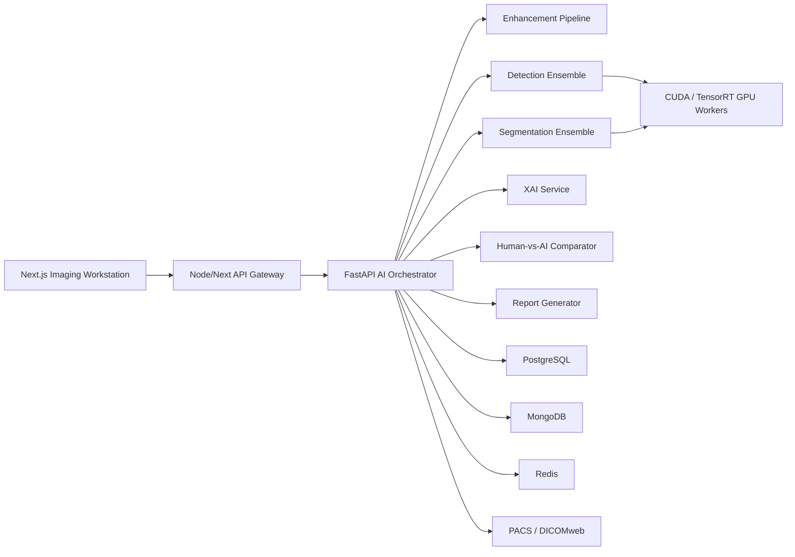

# FractureIQ Architecture

## System Overview

FractureIQ is organized as a clinical workstation plus AI orchestration platform.

## Frontend

- Next.js app router
- TypeScript domain models
- Tailwind clinical UI
- Imaging workspace with original, enhanced, segmentation, heatmap, and ensemble views
- Benchmarking and research analytics panels
- Manual annotation workflow placeholder for polygon, mask, and bounding-box tools

## Backend

- FastAPI REST service with WebSocket-ready orchestration boundaries
- Upload and DICOM metadata extraction hooks
- Enhancement, inference, fusion, XAI, metrics, reporting, and audit modules
- Pydantic contracts shared across APIs

## AI Pipeline

1. Validate upload and metadata.
2. Parse DICOM if applicable, de-identify if policy requires it.
3. Normalize image and run enhancement candidates.
4. Execute detection models in parallel GPU workers.
5. Execute segmentation models for pixel-level masks.
6. Generate Grad-CAM, Grad-CAM++, Score-CAM, SHAP, LIME, and attention overlays where supported.
7. Estimate severity, displacement, angular deformity, gap size, and cortical disruption.
8. Fuse model outputs using weighted voting plus Bayesian confidence fusion.
9. Compare AI output to human annotations when available.
10. Generate clinical and research reports.

## Model Registry

Detection:

- YOLOv9, YOLOv10, YOLOv11
- Faster R-CNN, Mask R-CNN, RetinaNet
- EfficientDet
- DETR, RT-DETR
- Cascade R-CNN

Segmentation:

- U-Net, Attention U-Net, TransUNet
- DeepLabV3+
- nnU-Net

Analytical:

- MLV and LASKR adapter interfaces
- Regression-based severity estimation
- Confidence interval estimation
- Weighted model voting
- Bayesian confidence fusion

## Compliance Architecture

- JWT authentication and role-based access control
- Audit logs for all upload, inference, annotation, report, and export events
- Encryption in transit and at rest
- De-identification boundary before research exports
- Version-controlled annotations
- Human-in-the-loop report approval

